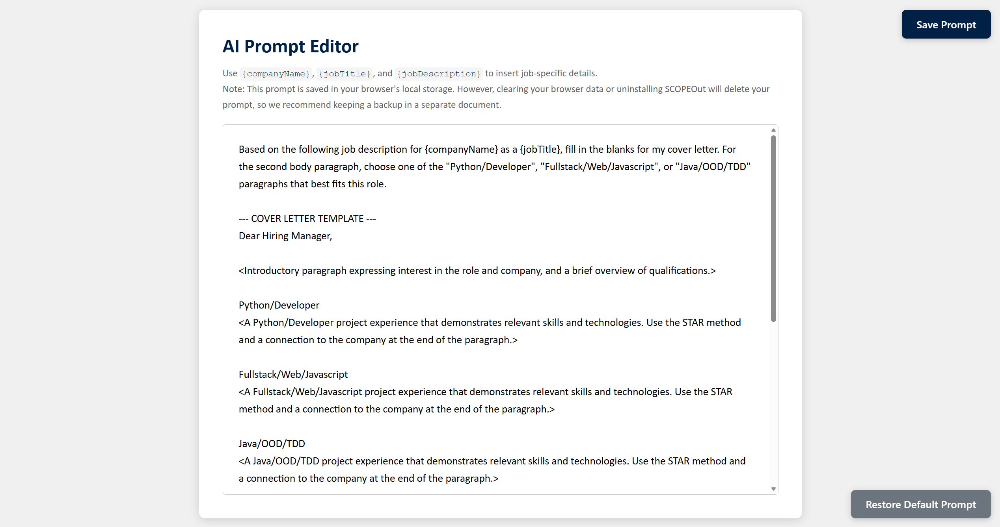
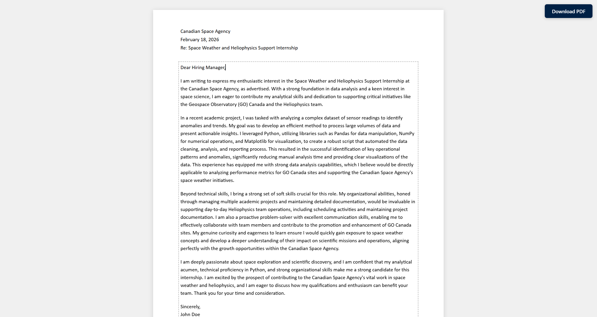

<div align="center">


# SCOPEOut

An extension that generates custom cover letters for [SCOPE](https://scope.sciencecoop.ubc.ca) jobs in a single click.

[](https://developer.chrome.com/docs/extensions/mv3/)
[](https://developer.mozilla.org/en-US/docs/Web/JavaScript)
[](https://ai.google.dev/)
[](https://www.gnu.org/licenses/gpl-3.0)

</div>

## 📑 Table of Contents
- [👀 App Preview](#-app-preview)
- [✨ Features](#-features)
- [🛠️ Tech Stack](#️-tech-stack)
- [📁 Project Structure](#-project-structure)
- [🚀 Getting Started](#-getting-started)
- [⚙️ Configuration](#️-configuration)
- [🤖 How It Works](#-how-it-works)
- [📝 License](#-license)

## 👀 App Preview
<div align="center">
  
</div>

<div align="center">
  
  
</div>

## ✨ Features

- **One-click Generation**: Navigate to any SCOPE job posting and SCOPEOut will scrape the company name, job title, and full job description and feed your customised prompt into Gemini.
- **Automatic Formatting**: Every generated document will automatically include the company name, date, and job title in the header, and the UBC Science Co-op banner in the footer.
- **In-browser Editing**: Edit any part of the generated cover letter before saving as a PDF.
- **Custom Prompts**: Fully adjustable AI prompts with dynamic placeholders for job details such as the company name, job title, and job description.
- **Multi-Model Support**: Toggle between different Gemini AI models with any API key.

## 🛠️ Tech Stack

| Layer | Technology |
|---|---|
| Extension platform | Chrome Extensions Manifest V3 |
| Language | Vanilla JavaScript (ES Modules) |
| AI backend | Google Gemini API |

## 📁 Project Structure

```
SCOPEOut/
├── src/
│   ├── manifest.json               # Extension manifest (MV3)
│   ├── assets/
│   │   ├── scope_out_icon.png      # Extension icon
│   │   └── science_coop_footer.png # Footer image used in the cover letter preview
│   ├── api/
│   │   ├── gemini.js               # Gemini API client: builds prompt & calls generateContent
│   │   └── default-prompt.js       # Default cover letter prompt template with placeholders
│   ├── background/
│   │   └── service-worker.js       # MV3 service worker: orchestrates scraping, generation & preview
│   ├── content/
│   │   └── scraper.js              # Content script injected into SCOPE pages to extract job data
│   ├── popup/
│   │   ├── popup.html              # Extension popup UI
│   │   ├── popup.css
│   │   └── popup.js                # Popup controller: settings, model picker, generation trigger
│   ├── preview/
│   │   ├── preview.html            # Cover letter preview page
│   │   ├── preview.css
│   │   └── preview.js              # Renders paginated, editable letter; handles PDF download
│   └── prompt-editor/
│       ├── prompt-editor.html      # Full-page prompt editor
│       ├── prompt-editor.css
│       └── prompt-editor.js        # Prompt editor controller: load, save, restore default
└── example_job_page.html           # Static replica of a SCOPE posting for local testing
```

## 🚀 Getting Started

### Prerequisites

- Google Chrome (or any Chromium-based browser that supports Manifest V3)
- A free [Google Gemini API key](https://aistudio.google.com/welcome)

### Installation

1. **Clone or download** this repository:
   ```bash
   git clone https://github.com/ExxML/SCOPEOut.git
   ```

2. Open Chrome and navigate to `chrome://extensions/`.

3. Enable **Developer mode** (toggle in the top-right corner).

4. Click **Load unpacked** and select the `src/` folder inside the cloned repository.

### First-time Setup

1. Click the SCOPEOut icon to open the popup.
2. Click **Settings** to expand the settings panel.
3. Paste your Gemini API key into the field.
4. Click **Save** (the extension will validate the key against all supported models).
5. Once the key is confirmed valid, the **Generate cover letter** button will become available.

## ⚙️ Configuration

### Selecting a Model

Use the **Model** dropdown under **Settings** in the popup to choose a Gemini model. Each option shows the rate limits for the free tier:

| Model | Requests / min | Requests / day |
|---|---|---|
| Gemini 2.5 Flash Lite | 10 | 20 |
| Gemini 2.5 Flash (default) | 5 | 20 |
| Gemini 3 Flash Preview | 5 | 20 |

Based on personal experimentation, these three models work well enough for generating cover letters, but you can clone this project and experiment with different models yourself (edit only `model-select` in `popup.html`).

### Customising the Prompt

1. Open the popup and expand **Settings**.
2. Click **Edit prompt** to open the Prompt Editor in a new tab.
3. Modify the template as desired. Three placeholders are available:
    - `{companyName}` : the organisation name scraped from the posting
    - `{jobTitle}` : the cleaned job title scraped from the posting
    - `{jobDescription}` : the full job description scraped from the posting
4. Click **Save Prompt**. The tab title shows `(*)` while there are unsaved changes.
5. Click **Restore Default Prompt** to revert to the built-in template at any time.

> [!NOTE]
> This prompt is saved in your browser's local storage. However, clearing your browser data or uninstalling SCOPEOut will delete your prompt, so we recommend keeping a backup in a separate document.


## 🤖 How It Works

```
User clicks "Generate cover letter"
        │
        ▼
popup.js validates active tab URL (must be scope.sciencecoop.ubc.ca)
        │
        ▼
Sends "startGeneration" message → service-worker.js
        │
        ▼
chrome.scripting.executeScript injects content/scraper.js
        │   Extracts: companyName, jobTitle, jobDescription
        ▼
gemini.js builds prompt (replaces placeholders in stored/default template)
        │
        ▼
POST to Gemini API (generateContent endpoint)
        │
        ▼
Cover letter body returned → stored in chrome.storage.session
        │
        ▼
preview/preview.html opened in new tab
        │   Renders paginated, editable letter
        ▼
User edits in-browser → clicks "Download PDF" → window.print()
```

Generation progress is written to `chrome.storage.session` at each stage (`generating` → `complete` / `error`), so the popup displays live status updates even if it is closed and reopened during generation.

## 📝 License

This project is licensed under the [GNU General Public License v3.0](LICENSE).
