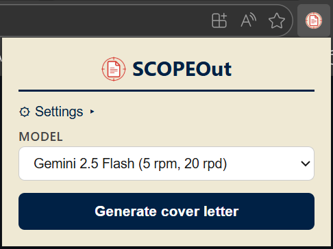
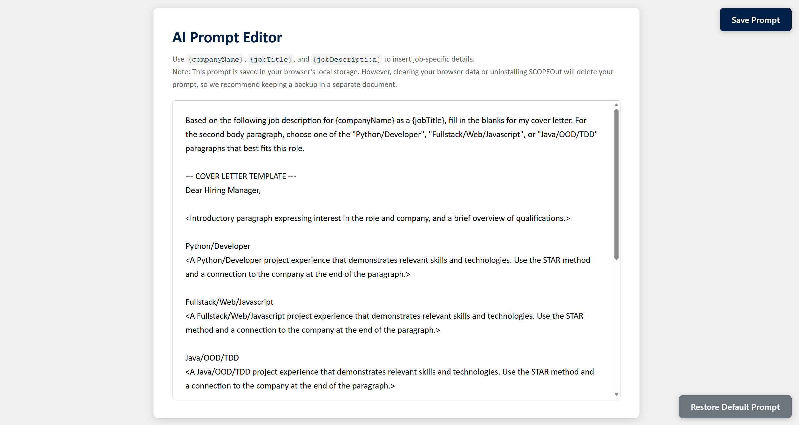
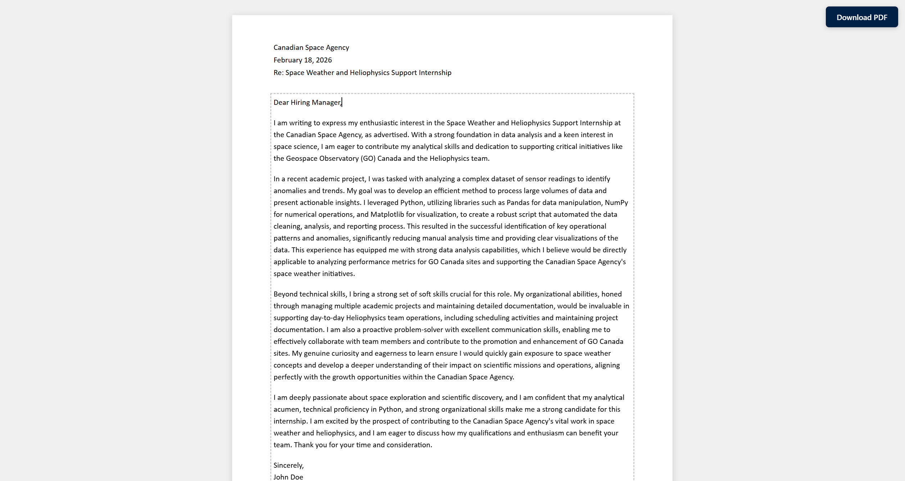

<div align="center" markdown="1">


# SCOPEOut

An extension that generates custom cover letters for UBC Co-op jobs in a single click, including [SCOPE](https://scope.sciencecoop.ubc.ca), [PD Portal](https://pdportal.apsc.ubc.ca/), and more!

[](https://developer.chrome.com/docs/extensions/mv3/)
[](https://developer.mozilla.org/en-US/docs/Web/JavaScript)
[](https://ai.google.dev/)
[](https://www.gnu.org/licenses/gpl-3.0)

### Check it out! [SCOPEOut on Chrome Web Store](https://chromewebstore.google.com/detail/neogidhokkpmbgddpofkfjodfpkidgaf?utm_source=item-share-cb)

</div>

## 📑 Table of Contents
- [👀 App Preview](#-app-preview)
- [✨ Features](#-features)
- [🛠️ Installation](#️-installation)
- [🚀 First-time Setup](#-first-time-setup)
- [⚙️ Configuration](#️-configuration)
- [💻 Tech Stack](#-tech-stack)
- [📁 Project Structure](#-project-structure)
- [🤖 How It Works](#-how-it-works)
- [📝 License](#-license)

## 👀 App Preview
<div align="center">
  
  
</div>

<div align="center">
  
</div>

## ✨ Features

- **One-click Generation**: Navigate to any UBC Co-op job posting and SCOPEOut will scrape the company name, job title, and full job description and feed your customised prompt into Gemini.
- **Automatic Formatting**: Every generated document will automatically include the company name, date, and job title in the header, and an optional UBC Science Co-op or Engineering Co-op banner in the footer.
- **In-browser Editing**: Edit any part of the generated cover letter before saving as a PDF.
- **Custom Prompts**: Fully adjustable AI prompts with dynamic placeholders for job details such as the company name, job title, and job description.
- **Multi-Model Support**: Toggle between different Gemini AI models with any API key.

## 🛠️ Installation

- Follow the steps below to load the extension from source, or simply install the extension from the [Chrome Web Store](https://chromewebstore.google.com/detail/neogidhokkpmbgddpofkfjodfpkidgaf?utm_source=item-share-cb).

1. **Clone or download** this repository:
   ```bash
   git clone https://github.com/ExxML/SCOPEOut.git
   ```
2. Open your browser and navigate to the **Manage Extensions** page.
3. Enable **Developer mode**.
4. Click **Load unpacked** and select the `src/` folder inside the cloned repository.

Note: This extension requires a Chromium-based browser that supports Manifest V3. Most modern browsers are compatible.

## 🚀 First-time Setup

1. Click SCOPEOut in the Extensions menu to open the extension.
2. Click **Settings** to expand the settings panel.
3. Get a free [Gemini API key](https://aistudio.google.com/welcome) and paste it in the field.
4. Click **Save**. SCOPEOut will validate the key and fetch its available models. Once the key is confirmed to be valid, the **Generate cover letter** button will become enabled.
5. Stay in the settings panel and select the **Co-op Footer Image** you wish to use (if any).
6. Click **Edit prompt** and personalize your AI prompt by replacing the example text with your experiences/skills. Refer to [Customising the Prompt](#customising-the-prompt) for more detailed instructions.
7. Once you have made your edits and saved your prompt, return to the extension and select your desired AI model. Refer to [Choosing the Right Model](#choosing-the-right-model) to pick the model that works for you.
8. The setup has been completed! You can now open any UBC Co-op job posting, click **Generate cover letter**, **Download PDF**, and ship your personalized cover letter to your dream company!

## ⚙️ Configuration

### Customising the Prompt

1. Open the popup and expand **Settings**.
2. Click **Edit prompt** to open the Prompt Editor in a new tab.
3. Modify the template as desired. Three placeholders are available:
    - `{companyName}` : the organisation name scraped from the posting
    - `{jobTitle}` : the cleaned job title scraped from the posting
    - `{jobDescription}` : the full job description scraped from the posting
4. Click **Save Prompt**. The tab title shows `(*)` while there are unsaved changes.
5. Click **Restore Default** to revert to the built-in template at any time.

> [!NOTE]
> This prompt is saved in your browser's local storage. Therefore, clearing your browser data or uninstalling SCOPEOut will delete your prompt, so we recommend keeping a backup in a separate document.

### Choosing the Right Model

Use the **Model** dropdown in the popup to choose a Gemini model. The list is fetched from the Gemini API each time the popup opens, so new models appear automatically and deprecated ones are removed. Only general-purpose text-in, text-out models (including previews and `-latest` aliases) are shown, sorted newest first.

The newest Gemini models are often under heavy load and requests may frequently get rejected (and still use up your quota). If consistency matters to you, we recommend using slightly less popular models to avoid these hiccups.

Free tier rate limits vary by model; see [Gemini API rate limits](https://ai.google.dev/gemini-api/docs/rate-limits) for up-to-date quotas.

## 💻 Tech Stack

| Layer | Technology |
|---|---|
| Extension platform | Chrome Extensions Manifest V3 |
| Language | Vanilla JavaScript (ES Modules) |
| AI backend | Google Gemini API |

## 📁 Project Structure

```
SCOPEOut/
├── src/
│   ├── manifest.json                # Extension manifest (MV3)
│   ├── assets/
│   │   ├── scope_out_icon_128.png   # 128x128 Extension icon
│   │   ├── scope_out_icon_2048.png  # Full resolution extension icon
│   │   ├── eng_coop_footer.png      # Engineering Co-op footer image for cover letter
│   │   └── science_coop_footer.png  # Science Co-op footer image for cover letter
│   ├── api/
│   │   ├── gemini.js                # Gemini API client: lists models, builds prompt & calls generateContent
│   │   └── default-prompt.js        # Default cover letter prompt template with placeholders
│   ├── background/
│   │   └── service-worker.js        # MV3 service worker: orchestrates scraping, generation & preview
│   ├── content/
│   │   └── scraper.js               # Content script injected into job posting pages to extract job data
│   ├── popup/
│   │   ├── popup.html               # Extension popup UI
│   │   ├── popup.css
│   │   └── popup.js                 # Popup controller: settings, model picker, generation trigger
│   ├── preview/
│   │   ├── preview.html             # Cover letter preview page
│   │   ├── preview.css
│   │   └── preview.js               # Renders paginated, editable letter; handles PDF download
│   └── prompt-editor/
│       ├── prompt-editor.html       # Full-page prompt editor
│       ├── prompt-editor.css
│       └── prompt-editor.js         # Prompt editor controller: load, save, restore default
└── README.md
```

## 🤖 How It Works

```
User clicks "Generate cover letter"
        │
        ▼
popup.js validates active tab URL
        │
        ▼
Sends "startGeneration" message → service-worker.js
        │
        ▼
chrome.scripting.executeScript injects content/scraper.js
        │   Extracts: companyName, jobTitle, jobDescription
        ▼
gemini.js builds prompt (replaces placeholders in stored/default template)
        │
        ▼
POST to Gemini API (generateContent endpoint)
        │
        ▼
Cover letter body returned → stored in chrome.storage.session
        │
        ▼
preview/preview.html opened in new tab
        │   Renders paginated, editable letter
        ▼
User edits in-browser → clicks "Download PDF" → window.print()
```

Generation progress is written to `chrome.storage.session` at each stage (`generating` → `complete` / `error`), so the popup displays live status updates even if it is closed and reopened during generation.

## 📝 License

This project is licensed under the [GNU General Public License v3.0](LICENSE).
